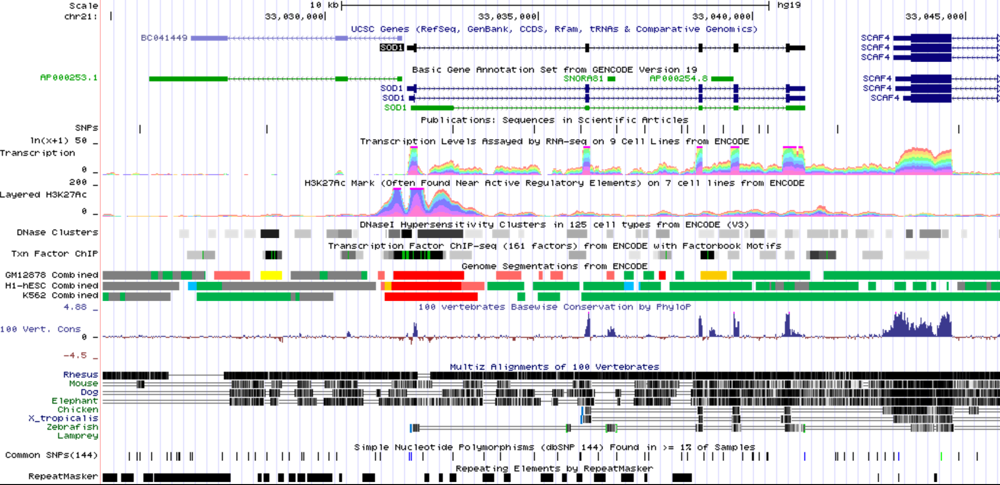

#  lxy [](https://godoc.org/github.com/cb01/lxy) 
[](https://app.wercker.com/project/bykey/c427b44ec31d9af19c49cfb664ba3490)

A command-line tool for application of contact genomic data to the problems of genome scaffolding, phasing, and clustering.

## Features

* __Genome Scaffolding__: Scaffolding of genomes is performed, leveraging Hi-C contact genomic sequence data
* __Haplotype Phasing__:  Uses Hi-C data to reconstruct long-distance haplotypes
* __High Performance__:  Written in Go to enable fast, concurrent processing
* __Easily Installable__:  Easy to download and install by including dependencies and precompiled binaries

## Getting Started

With Go set up on your system (https://golang.org/doc/install):

```go
go get github.com/cb01/lxy
``` 


## Scaffolding

In order to perform phasing, lxy needs both a set of called variants in vcf format and a set of aligned Hi-C reads. Preferably, these reads will have been filtered for those aligning to variant positions.

```sh
lxy scaff prep -a [alignment file] -l [links filename]
lxy scaff infer -l [links file] -s [scaffolding filename]
lxy scaff eval -s [scaffolding filename] -e [evaluaiton filename]
```

or, in one command

```sh
lxy scaff all -a [alignment file] -s [scaffolding filename] -e [evaluaiton filename]
```

Resulting in the following (show command line gif)


## Haplotype phasing

In order to perform phasing, lxy needs both a set of called variants in vcf format and a set of aligned Hi-C reads. Preferably, these reads will have been filtered for those aligning to variant positions.

```sh
lxy phase prep -a [alignment file] -l [links filename]
lxy phase infer -l [links filenmae] -p [phasing filename]
lxy phase eval -p [phasing filename] -e [evaluation filename] 
```

or, in one command

```sh
lxy phase all -a [alignment file] -s [phasing filename] -e [evaluaiton filename]
```


## Utilities

LXY also includes various basic utilities that are available through the cli, such as for fasta masking

```sh
lxy util mask --fasta [/path/to/fasta.fa] --vcf [/path/to/vcf.vcf]
```

and partitioning a fasta into windows of a designated size

```sh
lxy util partition --fasta [/path/to/fasta.fa] --windowsize 1000000 
```


## Additional visualizaiton capability

TODO, planning to include browser shot here that shows tracks generated showing Hi-C read coverage and SNPs.




## License

lxy is released under the BSD License. See [LICENSE](https://github.com/cb01/lxy/blob/master/LICENSE).


